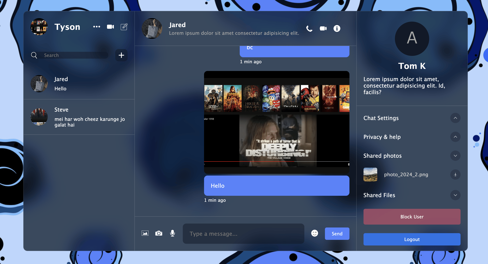
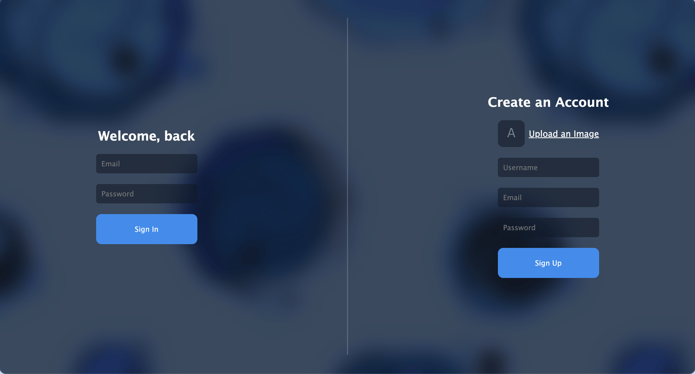
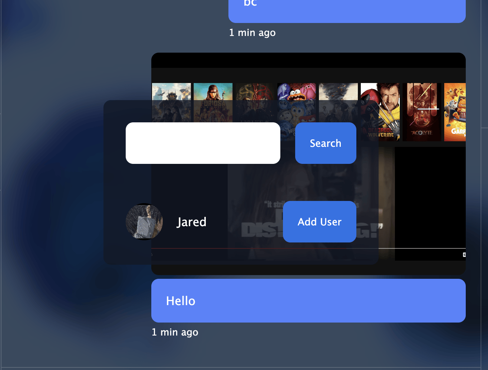

# SayHello

This messaging application allows users to engage with the P Zero features through a user-friendly interface. It leverages modern technologies to provide a seamless and efficient messaging experience.

Key Features:

Real-time Messaging: Users can send and receive messages instantly.
User-Friendly Interface: A clean and intuitive interface designed for easy navigation.
Secure Communication: Ensures secure and private messaging through robust security measures.
Technology Stack:

Frontend: React JS and Sass for a responsive and visually appealing user interface.
Backend: Firebase Firestore for real-time database operations, storing user chats and other relevant data.

